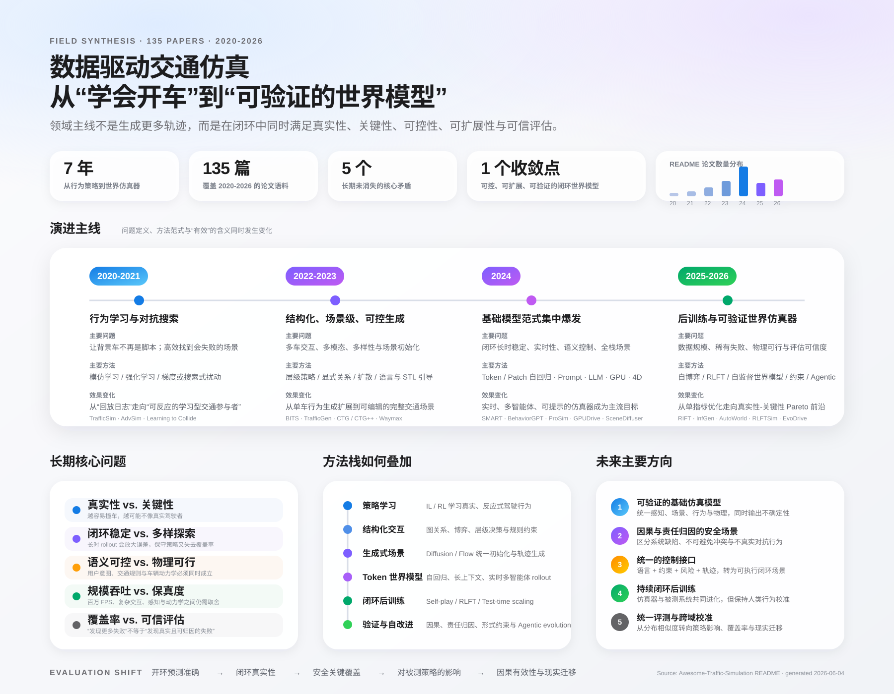

# Awesome-Traffic-Agent-Scene-Simulation-For-Autonomous-Driving

Papers related to data-driven traffic agent or traffic scene simulation for autonomous driving, including:
- learning-based traffic agent models (single-agent and multi-agent)
- traffic scene generation
- adversarial trajectory and traffic scene generation

Some papers focus on a more general traffic agent simulator, while some papers focus on safety-critical behavior or scenario in particular. Contributions are welcome! Please add new papers to the appropriate year section, sorted by month (descending), and include links to the project/code if available.

## Challenges
- Waymo Open Sim Agents Challenge: [2025](https://waymo.com/open/challenges/2025/sim-agents/), [2024](https://waymo.com/open/challenges/2024/sim-agents/)

## Workshops
- IV 2024 Workshop SAFE-DRIVE: Data-Driven Simulations and Multi-Agent Interactions for Autonomous Vehicle Safety
[Website](https://safeav.github.io/)

- CVPR2024 Workshop on Data-Driven Autonomous Driving Simulation.
[Website](https://agents4ad.github.io/)

- IROS2023 Workshop on Traffic Agent Modeling for Autonomous Driving Simulation.
[Website](https://agents4ad.github.io/2023/)

## Papers

> Papers are grouped by the first arXiv submission year and sorted by month in descending order. For papers without an arXiv preprint, the venue publication date is used. Publication status reflects the latest confirmed venue; otherwise it is listed as `arXiv`.

### 2026

- **2026-06** | `arXiv` | [EvoDrive: Pareto Evolution for Safety-Critical Autonomous Driving via Self-Improving LLM Agents](https://arxiv.org/abs/2606.03678)
- **2026-05** | `arXiv` | [Beyond Self-Play: Hierarchical Reasoning for Continuous Motion in Closed-Loop Traffic Simulation](https://arxiv.org/abs/2605.09153)
- **2026-05** | `ICRA` | [Conditional Flow-VAE for Safety-Critical Traffic Scenario Generation](https://arxiv.org/abs/2605.04366)
- **2026-05** | `arXiv` | [Decoupled Intelligence: A Multi-Agent LLM Framework for Controllable Traffic Scenario Generation in SUMO](https://arxiv.org/abs/2605.27685)
- **2026-05** | `arXiv` | [Guiding Neuro-Symbolic Scenario Generation with Spatio-Temporal Logic](https://arxiv.org/abs/2605.19038)
- **2026-05** | `arXiv` | [Learning Responsibility-Attributed Adversarial Scenarios for Testing Autonomous Vehicles](https://arxiv.org/abs/2605.13751)
- **2026-05** | `arXiv` | [PCASim: Promptable Closed-loop Adversarial Simulation for Urban Traffic Environment](https://arxiv.org/abs/2605.15654)
- **2026-05** | `CVPR` | [RLFTSim: Realistic and Controllable Multi-Agent Traffic Simulation via Reinforcement Learning Fine-Tuning](https://arxiv.org/abs/2605.19033) [[Project]](https://ehsan-ami.github.io/rlftsim)
- **2026-05** | `arXiv` | [SceneFactory: GPU-Accelerated Multi-Agent Driving Simulation with Physics-Based Vehicle Dynamics](https://arxiv.org/abs/2605.08528)
- **2026-05** | `ICRA` | [Traffic Scenario Orchestration from Language via Constraint Satisfaction](https://arxiv.org/abs/2605.06966)
- **2026-04** | `CVPR` | [Efficient Equivariant Transformer for Self-Driving Agent Modeling](https://arxiv.org/abs/2604.01466)
- **2026-04** | `FSE` | [From Particles to Perils: SVGD-Based Hazardous Scenario Generation for Autonomous Driving Systems Testing](https://arxiv.org/abs/2604.18918)
- **2026-04** | `CVPR Workshop` | [Heterogeneous Self-Play for Realistic Highway Traffic Simulation](https://arxiv.org/abs/2604.16406)
- **2026-04** | `arXiv` | [OccDirector: Language-Guided Behavior and Interaction Generation in 4D Occupancy Space](https://arxiv.org/abs/2604.22240)
- **2026-04** | `arXiv` | [ScenarioControl: Vision-Language Controllable Vectorized Latent Scenario Generation](https://arxiv.org/abs/2604.17147)
- **2026-03** | `arXiv` | [AutoWorld: Scaling Multi-Agent Traffic Simulation with Self-Supervised World Models](https://arxiv.org/abs/2603.28963)
- **2026-03** | `arXiv` | [Composing Driving Worlds through Disentangled Control for Adversarial Scenario Generation](https://arxiv.org/abs/2603.12864)
- **2026-03** | `arXiv` | [Enactor: From Traffic Simulators to Surrogate World Models](https://arxiv.org/abs/2603.18266)
- **2026-03** | `arXiv` | [Learning Rollout from Sampling: An R1-Style Tokenized Traffic Simulation Model](https://arxiv.org/abs/2603.24989)
- **2026-03** | `arXiv` | [Map-Agnostic And Interactive Safety-Critical Scenario Generation via Multi-Objective Tree Search](https://arxiv.org/abs/2603.03978)
- **2026-03** | `arXiv` | [Risk-Controllable Multi-View Diffusion for Driving Scenario Generation](https://arxiv.org/abs/2603.11534)
- **2026-03** | `arXiv` | [SaFeR: Safety-Critical Scenario Generation for Autonomous Driving Test via Feasibility-Constrained Token Resampling](https://arxiv.org/abs/2603.04071)
- **2026-03** | `SAE` | [Safety-Centered Scenario Generation for Autonomous Vehicles](https://arxiv.org/abs/2603.03574)
- **2026-02** | `arXiv` | [An LLM-driven Scenario Generation Pipeline Using an Extended Scenic DSL for Autonomous Driving Safety Validation](https://arxiv.org/abs/2602.20644)
- **2026-02** | `arXiv` | [ROMAN: Reward-Orchestrated Multi-Head Attention Network for Autonomous Driving System Testing](https://arxiv.org/abs/2602.05629)
- **2026-01** | `Transportmetrica A` | [SG-CADVLM: A Context-Aware Decoding Powered Vision Language Model for Safety-Critical Scenario Generation](https://arxiv.org/abs/2601.18442)

### 2025

- **2025-12** | `arXiv` | [Optimization-Guided Diffusion for Interactive Scene Generation](https://arxiv.org/abs/2512.07661) [[Project]](https://opendrivelab.com/OMEGA)
- **2025-12** | `arXiv` | [Post-Training and Test-Time Scaling of Generative Agent Behavior Models for Interactive Autonomous Driving](https://arxiv.org/abs/2512.13262)
- **2025-11** | `arXiv` | [MDG: Masked Denoising Generation for Multi-Agent Behavior Modeling in Traffic Environments](https://arxiv.org/abs/2511.17496)
- **2025-10** | `arXiv` | [DecompGAIL: Learning Realistic Traffic Behaviors with Decomposed Multi-Agent Generative Adversarial Imitation Learning](https://arxiv.org/abs/2510.06913)
- **2025-09** | `arXiv` | [Advancing Multi-agent Traffic Simulation via R1-Style Reinforcement Fine-Tuning](https://arxiv.org/abs/2509.23993)
- **2025-07** | `ICCV` | [Generative Active Learning for Long-tail Trajectory Prediction via Controllable Diffusion Model](https://arxiv.org/abs/2507.22615)
- **2025-06** | `arXiv` | [Adv-BMT: Bidirectional Motion Transformer for Safety-Critical Traffic Scenario Generation](https://arxiv.org/abs/2506.09485) [[Project]](https://metadriverse.github.io/adv-bmt/)
- **2025-06** | `arXiv` | [SceneStreamer: Continuous Scenario Generation as Next Token Group Prediction](https://arxiv.org/abs/2506.23316) [[Project]](https://metadriverse.github.io/infgen/)
- **2025-06** | `ICCV` | [Long-term Traffic Simulation with Interleaved Autoregressive Motion and Scenario Generation](https://arxiv.org/abs/2506.17213) [[Project]](https://orangesodahub.github.io/InfGen/)
- **2025-05** | `ITSC` | [RADE: Learning Risk-Adjustable Driving Environment via Multi-Agent Conditional Diffusion](https://arxiv.org/abs/2505.03178)
- **2025-05** | `arXiv` | [RIFT: Group-Relative RL Fine-Tuning for Realistic and Controllable Traffic Simulation](https://arxiv.org/abs/2505.03344) [[Project]](https://currychen77.github.io/RIFT/)
- **2025-05** | `ITSC` | [Safety-Critical Traffic Simulation with Guided Latent Diffusion Model](https://arxiv.org/abs/2505.00515)
- **2025-04** | `ICCV` | [Decoupled Diffusion Sparks Adaptive Scene Generation](https://arxiv.org/abs/2504.10485) [[Project]](https://opendrivelab.com/Nexus/) [[Code]](https://github.com/OpenDriveLab/Nexus)
- **2025-04** | `ICCV` | [LANGTRAJ: Diffusion Model and Dataset for Language-Conditioned Trajectory Simulation](https://arxiv.org/abs/2504.11521)
- **2025-02** | `arXiv` | [Building reliable sim driving agents by scaling self-play](https://arxiv.org/abs/2502.14706) [[Project]](https://sites.google.com/view/reliable-sim-agents)
- **2025-02** | `ICML` | [Robust Autonomy Emerges from Self-Play](https://arxiv.org/abs/2502.03349)
- **2025-01** | `T-IV` | [Dream to Drive with Predictive Individual World Model](https://arxiv.org/abs/2501.16733) [[Project]](https://sites.google.com/view/piwm) [[Code]](https://github.com/gaoyinfeng/PIWM)
- **2025-01** | `arXiv` | [Revisit Mixture Models for Multi-Agent Simulation: Experimental Study within a Unified Framework](https://arxiv.org/abs/2501.17015)

### 2024

- **2024-12** | `CVPR` | [Causal Composition Diffusion Model for Closed-loop Traffic Generation](https://arxiv.org/abs/2412.17920)
- **2024-12** | `CVPR` | [Closed-Loop Supervised Fine-Tuning of Tokenized Traffic Models](https://arxiv.org/abs/2412.05334) [[Project]](https://zhejz.github.io/catk/) [[Code]](https://github.com/NVlabs/catk)
- **2024-12** | `arXiv` | [DeepMF: Deep Motion Factorization for Closed-Loop Safety-Critical Driving Scenario Simulation](https://arxiv.org/abs/2412.17487)
- **2024-12** | `arXiv` | [GPD-1: Generative Pre-training for Driving](https://arxiv.org/abs/2412.08643) [[Project]](https://wzzheng.net/GPD/)
- **2024-12** | `NeurIPS` | [SceneDiffuser: Efficient and Controllable Driving Simulation Initialization and Rollout](https://arxiv.org/abs/2412.12129)
- **2024-11** | `arXiv` | [DiffRoad: Realistic and Diverse Road Scenario Generation for Autonomous Vehicle Testing](https://arxiv.org/abs/2411.09451)
- **2024-10** | `IROS` | [AdvDiffuser: Generating Adversarial Safety-Critical Driving Scenarios via Guided Diffusion](https://arxiv.org/abs/2410.08453)
- **2024-10** | `arXiv` | [Data-driven Diffusion Models for Enhancing Safety in Autonomous Vehicle Traffic Simulations](https://arxiv.org/abs/2410.04809)
- **2024-10** | `ICLR` | [DynamicCity: Large-Scale 4D Occupancy Generation from Dynamic Scenes](https://arxiv.org/abs/2410.18084) [[Project]](https://dynamic-city.github.io) [[Code]](https://github.com/3DTopia/DynamicCity)
- **2024-09** | `SMC` | [Adversarial and Reactive Traffic Entities for Behavior-Realistic Driving Simulation: A Review](https://arxiv.org/abs/2409.14196)
- **2024-09** | `IROS` | [Controllable Traffic Simulation through LLM-Guided Hierarchical Reasoning and Refinement](https://arxiv.org/abs/2409.15135)
- **2024-09** | `ECCV` | [Improving Agent Behaviors with RL Fine-tuning for Autonomous Driving](https://arxiv.org/abs/2409.18343) [[Paper]](https://www.ecva.net/papers/eccv_2024/papers_ECCV/papers/03623.pdf)
- **2024-09** | `ECCV` | [Learning to Drive via Asymmetric Self-Play](https://arxiv.org/abs/2409.18218)
- **2024-09** | `CoRL` | [Promptable Closed-loop Traffic Simulation](https://arxiv.org/abs/2409.05863) [[Project]](https://ariostgx.github.io/ProSim/) [[Code]](https://github.com/Ariostgx/ProSim)
- **2024-09** | `ICRA` | [Realistic Extreme Behavior Generation for Improved AV Testing](https://arxiv.org/abs/2409.10669)
- **2024-09** | `ECCV Workshop` | [ReGentS: Real-World Safety-Critical Driving Scenario Generation Made Stable](https://arxiv.org/abs/2409.07830)
- **2024-09** | `RA-L` | [SEAL: Towards Safe Autonomous Driving via Skill-Enabled Adversary Learning for Closed-Loop Scenario Generation](https://arxiv.org/abs/2409.10320) [[Project]](https://cmubig.github.io/seal/) [[Code]](https://github.com/cmubig/seal)
- **2024-09** | `arXiv` | [Traffic Scene Generation from Natural Language Description for Autonomous Vehicles with Large Language Model](https://arxiv.org/abs/2409.09575) [[Project]](https://basiclab.github.io/TTSG/) [[Code]](https://github.com/basiclab/TTSG)
- **2024-08** | `ICCV` | [DriveArena: A Closed-loop Generative Simulation Platform for Autonomous Driving](https://arxiv.org/abs/2408.00415) [[Project]](https://pjlab-adg.github.io/DriveArena/) [[Code]](https://github.com/PJLab-ADG/DriveArena)
- **2024-08** | `ICLR` | [GPUDrive: Data-driven, multi-agent driving simulation at 1 million FPS](https://arxiv.org/abs/2408.01584) [[Code]](https://github.com/Emerge-Lab/gpudrive)
- **2024-08** | `arXiv` | [TrafficGamer: Reliable and Flexible Traffic Simulation for Safety-Critical Scenarios with Game-Theoretic Oracles](https://arxiv.org/abs/2408.15538) [[Project]](https://qiaoguanren.github.io/trafficgamer-demo/) [[Code]](https://github.com/qiaoguanren/TrafficGamer)
- **2024-07** | `ECCV` | [Solving Motion Planning Tasks with a Scalable Generative Model](https://arxiv.org/abs/2407.02797) [[Code]](https://github.com/HorizonRobotics/GUMP/)
- **2024-07** | `RA-L` | [KiGRAS: Kinematic-Driven Generative Model for Realistic Agent Simulation](https://arxiv.org/abs/2407.12940) [[Project]](https://kigras-mach.github.io/KiGRAS/)
- **2024-06** | `CoRL` | [FREA: Feasibility-Guided Generation of Safety-Critical Scenarios with Reasonable Adversariality](https://arxiv.org/abs/2406.02983) [[Project]](https://currychen77.github.io/FREA/) [[Code]](https://github.com/CurryChen77/FREA)
- **2024-06** | `ITSC` | [GOOSE: Goal-Conditioned Reinforcement Learning for Safety-Critical Scenario Generation](https://arxiv.org/abs/2406.03870)
- **2024-06** | `CVPR Workshop` | [KnowMoformer: Knowledge-Conditioned Motion Transformer for Controllable Traffic Scenario Simulation](https://agents4ad.github.io/assets/cvpr2024/papers/11.pdf)
- **2024-06** | `arXiv` | [LCSim: A Large-Scale Controllable Traffic Simulator](https://arxiv.org/abs/2406.19781) [[Project]](https://tsinghua-fib-lab.github.io/LCSim/) [[Code]](https://github.com/tsinghua-fib-lab/LCSim)
- **2024-06** | `arXiv` | [Model Predictive Simulation Using Structured Graphical Models and Transformers](https://arxiv.org/abs/2406.19635)
- **2024-06** | `NeurIPS` | [NAVSIM: Data-Driven Non-Reactive Autonomous Vehicle Simulation and Benchmarking](https://arxiv.org/abs/2406.15349)
- **2024-06** | `CVPR Workshop` | [RACL: Risk Aware Closed-Loop Agent Simulation with High Fidelity](https://agents4ad.github.io/assets/cvpr2024/papers/30.pdf)
- **2024-06** | `arXiv` | [Text-to-Drive: Diverse Driving Behavior Synthesis via Large Language Models](https://arxiv.org/abs/2406.04300) [[Project]](https://text-to-drive.github.io/)
- **2024-06** | `ITSC` | [Towards Interactive Autonomous Vehicle Testing: Vehicle-Under-Test-Centered Traffic Simulation](https://arxiv.org/abs/2406.02860)
- **2024-05** | `NeurIPS` | [BehaviorGPT: Smart Agent Simulation for Autonomous Driving with Next-Patch Prediction](https://arxiv.org/abs/2405.17372)
- **2024-05** | `CVPR` | [ChatScene: Knowledge-Enabled Safety-Critical Scenario Generation for Autonomous Vehicles](https://arxiv.org/abs/2405.14062)
- **2024-05** | `NeurIPS` | [Language-Driven Interactive Traffic Trajectory Generation](https://arxiv.org/abs/2405.15388) [[Code]](https://github.com/X1a-jk/InteractTraj)
- **2024-05** | `ICRA` | [SceneControl: Diffusion for Controllable Traffic Scene Generation](https://research-assets.waabi.ai/SceneControl/paper.pdf) [[Project]](https://waabi.ai/scenecontrol/) [[Poster]](https://research-assets.waabi.ai/SceneControl/poster.pdf)
- **2024-05** | `arXiv` | [SMART: Scalable Multi-agent Real-time Simulation via Next-token Prediction](https://arxiv.org/abs/2405.15677) [[Project]](https://smart-motion.github.io/smart/) [[Code]](https://github.com/rainmaker22/SMART?tab=readme-ov-file)
- **2024-05** | `arXiv` | [TorchDriveEnv: A Reinforcement Learning Benchmark for Autonomous Driving with Reactive, Realistic, and Diverse Non-Playable Characters](https://arxiv.org/abs/2405.04491) [[Code]](https://github.com/inverted-ai/torchdriveenv)
- **2024-05** | `arXiv` | [TSDiT: Traffic Scene Diffusion Models With Transformers](https://arxiv.org/abs/2405.02289)
- **2024-05** | `ICRA` | [UniGen: Unified Modeling of Initial Agent States and Trajectories for Generating Autonomous Driving Scenarios](https://arxiv.org/abs/2405.03807)
- **2024-04** | `IROS` | [DragTraffic: Interactive and Controllable Traffic Scene Generation for Autonomous Driving](https://arxiv.org/abs/2404.12624) [[Project]](https://chantsss.github.io/Dragtraffic/) [[Code]](https://github.com/chantsss/Dragtraffic)
- **2024-04** | `arXiv` | [Enhancing Autonomous Vehicle Training with Language Model Integration and Critical Scenario Generation](https://arxiv.org/abs/2404.08570)
- **2024-04** | `T-ITS` | [MRIC: Model-Based Reinforcement-Imitation Learning with Mixture-of-Codebooks for Autonomous Driving Simulation](https://arxiv.org/abs/2404.18464)
- **2024-04** | `IV` | [Scene-Extrapolation: Generating Interactive Traffic Scenarios](https://arxiv.org/abs/2404.17224)
- **2024-04** | `T-ITS` | [Versatile Behavior Diffusion for Generalized Traffic Agent Simulation](https://arxiv.org/abs/2404.02524) [[Project]](https://sites.google.com/view/versatile-behavior-diffusion)
- **2024-04** | `ICRA` | [WcDT: World-centric Diffusion Transformer for Traffic Scene Generation](https://arxiv.org/abs/2404.02082) [[Code]](https://github.com/yangchen1997/wcdt)
- **2024-03** | `ICRA` | [CaDRE: Controllable and Diverse Generation of Safety-Critical Driving Scenarios using Real-World Trajectories](https://arxiv.org/abs/2403.13208)
- **2024-03** | `CoRL` | [CtRL-Sim: Reactive and Controllable Driving Agents with Offline Reinforcement Learning](https://arxiv.org/abs/2403.19918) [[Project]](https://montrealrobotics.ca/ctrlsim/) [[Code]](https://github.com/montrealrobotics/ctrl-sim)
- **2024-03** | `ITSC` | [LitSim: Conflict-aware Policy for Long-term Interactive Traffic Simulation](https://arxiv.org/abs/2403.04299)
- **2024-03** | `ECCV` | [SLEDGE: Synthesizing Driving Environments with Generative Models and Rule-Based Traffic](https://arxiv.org/abs/2403.17933) [[Code]](https://github.com/autonomousvision/sledge)
- **2024-02** | `CVPR` | [Editable Scene Simulation for Autonomous Driving via Collaborative LLM-Agents](https://arxiv.org/abs/2402.05746) [[Project]](https://yifanlu0227.github.io/ChatSim/) [[Code]](https://github.com/yifanlu0227/ChatSim)
- **2024-02** | `IV` | [LimSim++: A Closed-Loop Platform for Deploying Multimodal LLMs in Autonomous Driving](https://arxiv.org/abs/2402.01246) [[Project]](https://pjlab-adg.github.io/limsim_plus/) [[Code]](https://github.com/PJLab-ADG/LimSim/tree/LimSim_plus)
- **2024-02** | `arXiv` | [OASim: an Open and Adaptive Simulator based on Neural Rendering for Autonomous Driving](https://arxiv.org/abs/2402.03830) [[Project]](https://pjlab-adg.github.io/OASim/) [[Code]](https://github.com/PJLab-ADG/OASim)
- **2024-01** | `ECCV` | [SAFE-SIM: Safety-Critical Closed-Loop Traffic Simulation with Diffusion-Controllable Adversaries](https://arxiv.org/abs/2401.00391) [[Code]](https://github.com/jxmmy7777/safe-sim)

### 2023

- **2023-12** | `ML4AD Workshop` | [HMSim: A Hierarchical Multi-Agent Learning-Based Simulator For Urban Driving Scenarios](https://ml4ad.github.io/files/papers2023/Hierarchical%20Learning-Based%20Autonomy%20Simulator.pdf) [[Project]](https://sites.google.com/ucsd.edu/h-sim/home)
- **2023-12** | `ECCV` | [RealGen: Retrieval Augmented Generation for Controllable Traffic Scenarios](https://arxiv.org/abs/2312.13303) [[Project]](https://realgen.github.io/)
- **2023-12** | `ICLR` | [Trajeglish: Traffic Modeling as Next-Token Prediction](https://arxiv.org/abs/2312.04535) [[Website]](https://research.nvidia.com/labs/toronto-ai/trajeglish/)
- **2023-11** | `CoRL` | [Learning Realistic Traffic Agents in Closed-loop](https://arxiv.org/abs/2311.01394)
- **2023-11** | `NeurIPS` | [Scenario Diffusion: Controllable Driving Scenario Generation With Diffusion](https://arxiv.org/abs/2311.02738)
- **2023-11** | `arXiv` | [SceneDM: Scene-level Multi-agent Trajectory Generation with Consistent Diffusion Models](https://arxiv.org/abs/2311.15736) [[Project]](https://alperen-hub.github.io/SceneDM/)
- **2023-11** | `T-IV` | [Tactics2D: A Highly Modular and Extensible Simulator for Driving Decision-making](https://arxiv.org/abs/2311.11058) [[Code]](https://github.com/WoodOxen/tactics2d)
- **2023-10** | `T-IV` | [Data-driven Traffic Simulation: A Comprehensive Review](https://arxiv.org/abs/2310.15975)
- **2023-10** | `NeurIPS` | [Waymax: An Accelerated, Data-Driven Simulator for Large-Scale Autonomous Driving Research](https://arxiv.org/abs/2310.08710) [[Code]](https://github.com/waymo-research/waymax)
- **2023-09** | `RA-L` | [DriveSceneGen: Generating Diverse and Realistic Driving Scenarios from Scratch](https://arxiv.org/abs/2309.14685) [[Project]](https://ss47816.github.io/DriveSceneGen/) [[Code]](https://github.com/SS47816/DriveSceneGen?tab=readme-ov-file)
- **2023-09** | `ICRA` | [Reinforcement Learning with Human Feedback for Realistic Traffic Simulation](https://arxiv.org/abs/2309.00709)
- **2023-09** | `IROS` | [SurrealDriver: Designing LLM-powered Generative Driver Agent Framework based on Human Drivers' Driving-thinking Data](https://arxiv.org/abs/2309.13193)
- **2023-08** | `T-ITS` | [TrafficMCTS: A Closed-Loop Traffic Flow Generation Framework with Group-Based Monte Carlo Tree Search](https://arxiv.org/abs/2308.12797)
- **2023-07** | `CoRL` | [Language Conditioned Traffic Generation](https://arxiv.org/abs/2307.07947) [[Project]](https://ariostgx.github.io/lctgen/) [[Code]](https://github.com/Ariostgx/lctgen)
- **2023-06** | `CoRL` | [Language-Guided Traffic Simulation via Scene-Level Diffusion](https://arxiv.org/abs/2306.06344) [[Code]](https://github.com/NVlabs/CTG)
- **2023-06** | `CVPR` | [MIXSIM: A Hierarchical Framework for Mixed Reality Traffic Simulation](https://openaccess.thecvf.com/content/CVPR2023/papers/Suo_MixSim_A_Hierarchical_Framework_for_Mixed_Reality_Traffic_Simulation_CVPR_2023_paper.pdf)
- **2023-05** | `arXiv` | [From Model-Based to Data-Driven Simulation: Challenges and Trends in Autonomous Driving](https://arxiv.org/abs/2305.13960)
- **2023-05** | `arXiv` | [Generating Driving Scenes with Diffusion](https://arxiv.org/abs/2305.18452)
- **2023-05** | `ITSC` | [TransWorldNG: Traffic Simulation via Foundation Model](https://arxiv.org/abs/2305.15743) [[Code]](https://github.com/SACLabs/TransWorldNG)
- **2023-03** | `RA-L` | [Editing Driver Character: Socially-Controllable Behavior Generation for Interactive Traffic Simulation](https://arxiv.org/abs/2303.13830)
- **2023-03** | `ICRA` | [TrafficBots: Towards World Models for Autonomous Driving Simulation and Motion Prediction](https://arxiv.org/abs/2303.04116) [[Code]](https://github.com/zhejz/TrafficBots)

### 2022

- **2022-11** | `DAI` | [RITA: Boost Driving Simulators with Realistic Interactive Traffic Flow](https://arxiv.org/abs/2211.03408)
- **2022-10** | `ICRA` | [Guided Conditional Diffusion for Controllable Traffic Simulation](https://arxiv.org/abs/2210.17366) [[Code]](https://github.com/NVlabs/CTG)
- **2022-10** | `IROS` | [InterSim: Interactive Traffic Simulation via Explicit Relation Modeling](https://arxiv.org/abs/2210.14413) [[Project]](https://tsinghua-mars-lab.github.io/InterSim/) [[Code]](https://github.com/Tsinghua-MARS-Lab/InterSim)
- **2022-10** | `ICRA` | [Traffic-Aware Autonomous Driving with Differentiable Traffic Simulation](https://arxiv.org/abs/2210.03772)
- **2022-10** | `ICRA` | [TrafficGen: Learning to Generate Diverse and Realistic Traffic Scenarios](https://arxiv.org/abs/2210.06609) [[Project]](https://metadriverse.github.io/trafficgen/) [[Code]](https://github.com/metadriverse/trafficgen)
- **2022-08** | `ICRA` | [BITS: Bi-level Imitation for Traffic Simulation](https://arxiv.org/abs/2208.12403) [[Blog]](https://developer.nvidia.com/blog/simulating-realistic-traffic-behavior-with-a-bi-level-imitation-learning-ai-model/) [[Code]](https://github.com/NVlabs/traffic-behavior-simulation)
- **2022-05** | `ICRA` | [Symphony: Learning Realistic and Diverse Agents for Autonomous Driving Simulation](https://arxiv.org/abs/2205.03195)
- **2022-04** | `ECCV` | [KING: Generating Safety-Critical Driving Scenarios for Robust Imitation via Kinematics Gradients](https://arxiv.org/abs/2204.13683) [[Project]](https://lasnik.github.io/king/) [[Code]](https://github.com/autonomousvision/king)
- **2022-03** | `T-ITS` | [TrajGen: Generating Realistic and Diverse Trajectories with Reactive and Feasible Agent Behaviors for Autonomous Driving](https://arxiv.org/abs/2203.16792) [[Code]](https://github.com/gaoyinfeng/TrajGen)
- **2022-02** | `T-ITS` | [A Survey on Safety-Critical Driving Scenario Generation -- A Methodological Perspective](https://arxiv.org/abs/2202.02215)

### 2021

- **2021-12** | `CVPR` | [Generating Useful Accident-Prone Driving Scenarios via a Learned Traffic Prior](https://arxiv.org/abs/2112.05077) [[Project]](https://research.nvidia.com/labs/toronto-ai/STRIVE/) [[Code]](https://github.com/nv-tlabs/STRIVE)
- **2021-01** | `CVPR` | [AdvSim: Generating Safety-Critical Scenarios for Self-Driving Vehicles](https://arxiv.org/abs/2101.06549)
- **2021-01** | `CVPR` | [SceneGen: Learning to Generate Realistic Traffic Scenes](https://arxiv.org/abs/2101.06541)
- **2021-01** | `CVPR` | [TrafficSim: Learning to Simulate Realistic Multi-Agent Behaviors](https://arxiv.org/abs/2101.06557)

### 2020

- **2020-11** | `IROS` | [Behaviorally Diverse Traffic Simulation via Reinforcement Learning](https://arxiv.org/abs/2011.05741)
- **2020-03** | `IROS` | [Learning to Collide: An Adaptive Safety-Critical Scenarios Generating Method](https://arxiv.org/abs/2003.01197)

## Acknowledgement
- [End-to-end Autonomous Driving](https://github.com/OpenDriveLab/End-to-end-Autonomous-Driving)
- [Awesome-Trajectory-Motion-Prediction-Papers](https://github.com/colorfulfuture/Awesome-Trajectory-Motion-Prediction-Papers)
